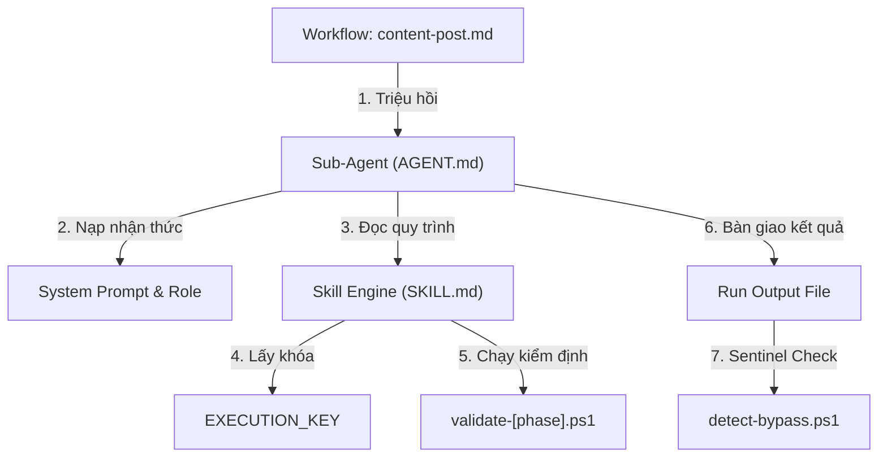

# Cognitive Agent Layer (Lớp Nhận thức Sub-Agent)

> **Tên file**: .agents/agents/README.md
> **Last update**: 21/05/2026 20:00 (GMT+7)
> **Vai trò**: Tài liệu hướng dẫn kiến trúc lớp nhận thức Sub-Agent của hệ thống AI Content Factory.
> **Sử dụng khi**: Lập trình viên hoặc điều phối viên cần hiểu cách hệ thống đa tác nhân vận hành và giao tiếp giữa các tầng.
> **Output**: Sơ đồ kiến trúc nhận thức và định nghĩa vai trò của 15 Sub-Agent.

Hệ thống AI Content Factory v3.7B áp dụng mô hình **Đa tác nhân phối hợp (Multi-Agent Cooperation)**. Trong đó, hệ thống được phân rã thành 3 lớp phân cấp rõ ràng:

1. **Workflow Layer (Lớp Điều phối)**: Bản đồ đường ống dẫn (`.agents/workflows/content-post.md`) điều khiển trình tự chạy và kiểm soát chất lượng qua Sentinel.
2. **Cognitive Agent Layer (Lớp Nhận thức Sub-Agent)**: Các thực thể AI chuyên biệt (`.agents/agents/`) chịu trách nhiệm về tư duy, phong cách viết, lập luận phản biện và các ranh giới nhận thức của từng bước.
3. **Execution Skill Engine (Động cơ Thực thi Kỹ thuật)**: Các quy trình kỹ thuật và script bổ trợ (`.agents/skills/`) đóng vai trò là công cụ hành động của Sub-Agent.

---

## Sơ đồ Kiến trúc Vận hành

---

## Danh sách 15 Specialized Sub-Agents

| Tên Agent | Thư mục định nghĩa | Vai trò cốt lõi |
|-----------|--------------------|-----------------|
| **ProfileSelectorAgent** | `profile-selector/` | Quản lý chế độ viết và cấu hình tham số |
| **SemanticRouterAgent** | `semantic-router/` | Định tuyến chủ đề vào Persona Pillars |
| **DikwBridgeAgent** | `dikw-bridge/` | Phân giải tri thức Obsidian theo cấu trúc DIKW |
| **IdeaCuratorAgent** | `idea-curator/` | Tạo góc nhìn contrarian độc đáo và chấm điểm lan truyền |
| **InsightAgent** | `insight-agent/` | Nghiên cứu dữ liệu, trích dẫn chuyên gia, chống bịa đặt (SAS) |
| **HookEngineerAgent** | `hook-engineer/` | Thiết kế câu mở đầu thu hút độc giả theo 15 công thức |
| **StructureDesignerAgent** | `structure-designer/` | Thiết lập khung xương bài viết 5 phần và thiết kế biểu đồ cảm xúc |
| **PersonaLoaderAgent** | `persona-loader/` | Nạp DNA giọng văn và JTBD của thương hiệu |
| **VoiceWriterAgent** | `voice-writer/` | Chắp bút bản thảo hoàn chỉnh, chống dấu vết AI |
| **QaCheckerAgent** | `qa-checker/` | Chấm điểm chất lượng nghiêm ngặt /130 điểm |
| **FormatAgent** | `format-agent/` | Đóng gói sản phẩm cuối, dọn dẹp thẻ code, ghi nhật ký |
| **BookExtractorAgent** | `book-extractor/` | Đào xúc, khai thác nội dung sách từ NotebookLM thành Raw Markdown có cấu trúc |
| **VividCuratorAgent** | `curate-vivids/` | Đánh giá, tinh lọc vivid metadata chất lượng cao và niêm phong dữ liệu |
| **BookAudienceMatcherAgent** | `book-audience-matcher/` | Phân giải JTBD của sách và so khớp Semantic với thư viện Audiences |
| **BookParserAgent** | `book-parser/` | Phân rã cấu trúc sách thành Atoms vật lý theo mô hình DIKW |
